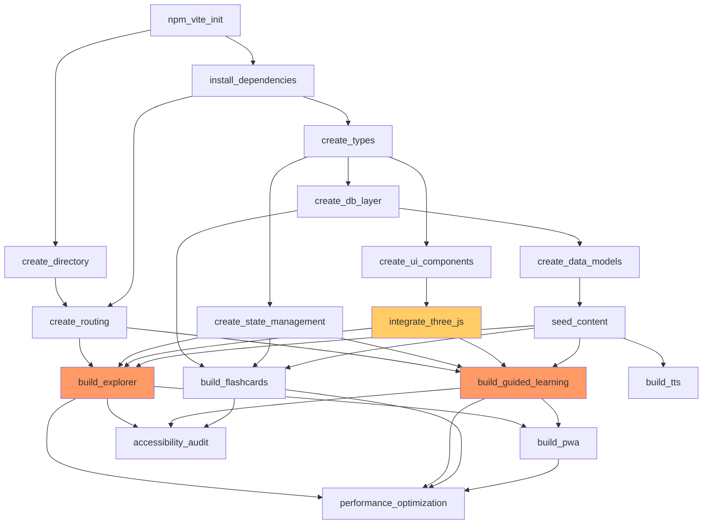

# Goal-Oriented Action Plan (GOAP) - Netter's Anatomy Learning Tool

**Document Version:** 1.0
**Generated:** 2025-12-29
**Target Model:** GOAP with A* Search Algorithm

---

## Executive Summary

This GOAP plan defines the optimal action sequence to transform an empty project directory into a production-ready PWA featuring interactive 3D anatomy exploration, guided learning, and spaced repetition flashcards. The plan uses precondition-effect analysis to identify dependencies, parallel execution opportunities, and critical path bottlenecks.

**Total Actions:** 18
**Estimated Duration:** 12-16 weeks
**Critical Path Length:** 9 actions
**Parallel Execution Opportunities:** 7 concurrent execution phases
**Agent Coordination Strategy:** Multi-agent swarm with mesh topology

---

## 1. State Space Definition

### 1.1 World State Properties

The GOAP system tracks the following state variables:

```typescript
interface WorldState {
  // Project Infrastructure
  projectInitialized: boolean;
  directoryStructure: boolean;
  dependenciesInstalled: boolean;

  // Type System & Data Layer
  typeDefinitionsDefined: boolean;
  databaseLayerImplemented: boolean;
  dataModelsCreated: boolean;

  // UI Foundation
  designSystemComponents: boolean;
  routingConfigured: boolean;
  stateManagementSetup: boolean;

  // 3D Rendering
  threeJsIntegrated: boolean;
  modelLoadingWorking: boolean;

  // Content
  contentSeeded: boolean;

  // Feature Modes
  explorerModeBuilt: boolean;
  guidedLearningBuilt: boolean;
  flashcardsBuilt: boolean;

  // Auxiliary Systems
  ttsImplemented: boolean;
  pwaConfigured: boolean;

  // Quality Gates
  accessibilityCompliant: boolean;
  performanceOptimized: boolean;
}
```

### 1.2 Current State (Initial)

```typescript
const INITIAL_STATE: WorldState = {
  projectInitialized: false,
  directoryStructure: false,
  dependenciesInstalled: false,
  typeDefinitionsDefined: false,
  databaseLayerImplemented: false,
  dataModelsCreated: false,
  designSystemComponents: false,
  routingConfigured: false,
  stateManagementSetup: false,
  threeJsIntegrated: false,
  modelLoadingWorking: false,
  contentSeeded: false,
  explorerModeBuilt: false,
  guidedLearningBuilt: false,
  flashcardsBuilt: false,
  ttsImplemented: false,
  pwaConfigured: false,
  accessibilityCompliant: false,
  performanceOptimized: false,
};
```

### 1.3 Goal State (Target)

```typescript
const GOAL_STATE: WorldState = {
  projectInitialized: true,
  directoryStructure: true,
  dependenciesInstalled: true,
  typeDefinitionsDefined: true,
  databaseLayerImplemented: true,
  dataModelsCreated: true,
  designSystemComponents: true,
  routingConfigured: true,
  stateManagementSetup: true,
  threeJsIntegrated: true,
  modelLoadingWorking: true,
  contentSeeded: true,
  explorerModeBuilt: true,
  guidedLearningBuilt: true,
  flashcardsBuilt: true,
  ttsImplemented: true,
  pwaConfigured: true,
  accessibilityCompliant: true,
  performanceOptimized: true,
};
```

---

## 2. Action Definitions with Preconditions & Effects

### Action 1: `npm_vite_init`

**Description:** Initialize React + TypeScript + Vite project
**Estimated Duration:** 30 minutes
**Action Cost:** 1
**Agent Type:** `backend-dev`

**Preconditions:**
- None (root action)

**Effects:**
- `projectInitialized = true`
- Creates `package.json`, `tsconfig.json`, `vite.config.ts`
- Establishes build pipeline

**Risk:** Low
**Mitigation:** Use stable Vite template (`npm create vite@latest`)

---

### Action 2: `create_directory`

**Description:** Set up project directory structure
**Estimated Duration:** 15 minutes
**Action Cost:** 1
**Agent Type:** `system-architect`

**Preconditions:**
- `projectInitialized = true`

**Effects:**
- `directoryStructure = true`
- Creates `/src/{app,components,hooks,lib,pages,services,stores,types,utils,data}`
- Creates `/tests`, `/docs`, `/public`

**Risk:** Low
**Mitigation:** Follow specification structure (Section 13.2)

---

### Action 3: `install_dependencies`

**Description:** Install all required npm packages
**Estimated Duration:** 5 minutes
**Action Cost:** 2
**Agent Type:** `backend-dev`

**Preconditions:**
- `projectInitialized = true`
- `directoryStructure = true`

**Effects:**
- `dependenciesInstalled = true`

**Required Packages:**
```json
{
  "dependencies": {
    "react": "^18.2.0",
    "react-dom": "^18.2.0",
    "react-router-dom": "^6.20.0",
    "@tanstack/react-query": "^5.14.0",
    "zustand": "^4.4.7",
    "dexie": "^3.2.4",
    "dexie-react-hooks": "^1.1.7",
    "@react-three/fiber": "^8.15.11",
    "@react-three/drei": "^9.92.2",
    "three": "^0.159.0",
    "ts-fsrs": "^3.1.0",
    "tailwindcss": "^3.3.6",
    "clsx": "^2.0.0"
  }
}
```

**Risk:** Medium (version conflicts)
**Mitigation:** Lock versions, test compatibility immediately

---

### Action 4: `create_types`

**Description:** Define TypeScript interfaces for data models
**Estimated Duration:** 2 hours
**Action Cost:** 3
**Agent Type:** `code-analyzer`

**Preconditions:**
- `projectInitialized = true`
- `dependenciesInstalled = true`

**Effects:**
- `typeDefinitionsDefined = true`
- Creates `/src/types/{structure,region,system,relationship,reference,chapter,module,flashcard,user}.ts`

**Key Types:**
- `Structure` (Section 11.1)
- `Relationship` (Section 5.3)
- `PhysicalReference` (Section 8.3)
- `FlashCard` (Section 11.2)
- `UserProgress` (Section 11.3)

**Risk:** Low
**Mitigation:** Align with spec Section 11 exactly

---

### Action 5: `create_db_layer`

**Description:** Implement Dexie.js IndexedDB layer
**Estimated Duration:** 3 hours
**Action Cost:** 4
**Agent Type:** `backend-dev`

**Preconditions:**
- `typeDefinitionsDefined = true`
- `dependenciesInstalled = true`

**Effects:**
- `databaseLayerImplemented = true`
- Creates `/src/lib/db/schema.ts`, `/src/lib/db/operations.ts`

**Database Schema:**
```typescript
class AnatomyDB extends Dexie {
  structures: Table<Structure>;
  regions: Table<Region>;
  systems: Table<System>;
  relationships: Table<Relationship>;
  physicalReferences: Table<PhysicalReference>;
  externalLinks: Table<ExternalLink>;
  chapters: Table<Chapter>;
  modules: Table<Module>;
  flashCards: Table<FlashCard>;
  userProgress: Table<UserProgress>;
  cardReviewStates: Table<CardReviewState>;
  studySessions: Table<StudySession>;
}
```

**Risk:** Medium (IndexedDB quota limits)
**Mitigation:** Implement storage quota monitoring, graceful degradation

---

### Action 6: `create_ui_components`

**Description:** Build design system primitive components
**Estimated Duration:** 4 hours
**Action Cost:** 5
**Agent Type:** `coder`

**Preconditions:**
- `typeDefinitionsDefined = true`
- `dependenciesInstalled = true`

**Effects:**
- `designSystemComponents = true`
- Creates `/src/components/ui/{Button,Card,Modal,Input,Badge,ProgressBar,Tabs}.tsx`

**Design System Specs:** Section 12.1, 12.2

**Component Inventory:**
1. Button (primary, secondary, ghost variants)
2. Card (with hover states)
3. Modal (overlay, focus trap)
4. Input (with labels, error states)
5. Badge (type indicators)
6. ProgressBar (linear, circular)
7. Tabs (horizontal, vertical)

**Risk:** Low
**Mitigation:** Use Tailwind for styling consistency

---

### Action 7: `create_routing`

**Description:** Set up React Router v6 navigation
**Estimated Duration:** 2 hours
**Action Cost:** 3
**Agent Type:** `coder`

**Preconditions:**
- `projectInitialized = true`
- `dependenciesInstalled = true`
- `directoryStructure = true`

**Effects:**
- `routingConfigured = true`
- Creates `/src/app/Router.tsx` with all routes (Section 4.3)

**Routes:**
```typescript
const routes = [
  '/explorer',
  '/explorer/region/:regionSlug',
  '/explorer/structure/:structureId',
  '/learn',
  '/learn/chapter/:chapterId',
  '/learn/chapter/:chapterId/:moduleId',
  '/learn/review',
  '/tools/flashcards',
  '/tools/bookmarks',
  '/settings',
];
```

**Risk:** Low
**Mitigation:** Lazy-load route components for performance

---

### Action 8: `create_state_management`

**Description:** Implement Zustand stores for client state
**Estimated Duration:** 2 hours
**Action Cost:** 3
**Agent Type:** `coder`

**Preconditions:**
- `typeDefinitionsDefined = true`
- `dependenciesInstalled = true`

**Effects:**
- `stateManagementSetup = true`
- Creates `/src/stores/{explorer,guided,flashcards,preferences}.ts`

**Store Slices:**
- `explorerStore`: Selected structure, visible layers, 3D camera state
- `guidedStore`: Current chapter/module, progress tracking
- `flashcardsStore`: Review queue, FSRS state
- `preferencesStore`: Display settings, TTS settings, accessibility flags

**Risk:** Low
**Mitigation:** Keep stores minimal, use React Query for server state

---

### Action 9: `integrate_three_js`

**Description:** Set up 3D rendering with React Three Fiber
**Estimated Duration:** 6 hours
**Action Cost:** 8
**Agent Type:** `coder`

**Preconditions:**
- `dependenciesInstalled = true`
- `typeDefinitionsDefined = true`
- `designSystemComponents = true`

**Effects:**
- `threeJsIntegrated = true`
- `modelLoadingWorking = true`
- Creates `/src/lib/three/{Scene,ModelLoader,Controls,Labels}.tsx`

**3D Viewer Features:**
- OrbitControls (rotate, zoom, pan)
- GLTF model loading with progress indicator
- Label system with leader lines
- Layer visibility controls
- Screenshot capability

**Risk:** High (performance, model complexity)
**Mitigation:**
- Implement LOD (level of detail)
- Use instanced rendering for repeated structures
- Throttle frame rate on low-end devices

---

### Action 10: `create_data_models`

**Description:** Define anatomical entity data structures
**Estimated Duration:** 8 hours
**Action Cost:** 6
**Agent Type:** `researcher`

**Preconditions:**
- `typeDefinitionsDefined = true`
- `databaseLayerImplemented = true`

**Effects:**
- `dataModelsCreated = true`
- Creates `/src/data/seed/{structures,relationships,references}.json`

**Data Scope:**
- Initial focus: Upper Limb (127 structures)
- Relationship types: All 11 types from Section 5.3
- Cross-references: Netter's Atlas plates 400-468

**Risk:** Medium (data accuracy, completeness)
**Mitigation:**
- Validate against Terminologia Anatomica 2019
- Cross-reference with Netter's Atlas 6th Edition
- Peer review data accuracy

---

### Action 11: `seed_content`

**Description:** Load structure data into IndexedDB
**Estimated Duration:** 1 hour
**Action Cost:** 2
**Agent Type:** `backend-dev`

**Preconditions:**
- `databaseLayerImplemented = true`
- `dataModelsCreated = true`

**Effects:**
- `contentSeeded = true`
- Populates all database tables with initial data

**Risk:** Low
**Mitigation:** Implement seed script with transaction handling

---

### Action 12: `build_explorer`

**Description:** Implement Interactive Explorer mode
**Estimated Duration:** 16 hours
**Action Cost:** 12
**Agent Type:** `coder`

**Preconditions:**
- `routingConfigured = true`
- `stateManagementSetup = true`
- `threeJsIntegrated = true`
- `designSystemComponents = true`
- `contentSeeded = true`

**Effects:**
- `explorerModeBuilt = true`

**Components to Build:**
- Regional overview screen (Section 6.2)
- Regional view with 3D viewer (Section 6.3)
- Structure tree navigation
- Structure detail view (Section 6.4)
- Search functionality (Section 6.6)
- Systems view toggle (Section 6.5)

**Risk:** High (complexity, integration)
**Mitigation:**
- Build incrementally (tree → 3D → detail → search)
- Test each component in isolation before integration

---

### Action 13: `build_guided_learning`

**Description:** Implement Guided Learning mode
**Estimated Duration:** 20 hours
**Action Cost:** 15
**Agent Type:** `coder`

**Preconditions:**
- `routingConfigured = true`
- `stateManagementSetup = true`
- `threeJsIntegrated = true`
- `designSystemComponents = true`
- `contentSeeded = true`

**Effects:**
- `guidedLearningBuilt = true`

**Components to Build:**
- Chapter selection screen (Section 7.3)
- Module view interface (Section 7.5)
- Overview module type (Section 7.4.1)
- Structure module type (Section 7.4.2)
- Synthesis module type (Section 7.4.3)
- Assessment module type (Section 7.4.4)
- Progress tracking (Section 7.8)

**Risk:** High (content authoring complexity)
**Mitigation:**
- Start with 1 complete chapter (Upper Limb)
- Template remaining chapters
- Separate content from rendering logic

---

### Action 14: `build_flashcards`

**Description:** Implement FSRS spaced repetition system
**Estimated Duration:** 12 hours
**Action Cost:** 10
**Agent Type:** `coder`

**Preconditions:**
- `dependenciesInstalled = true` (ts-fsrs)
- `databaseLayerImplemented = true`
- `stateManagementSetup = true`
- `designSystemComponents = true`
- `contentSeeded = true`

**Effects:**
- `flashcardsBuilt = true`

**Components to Build:**
- Flashcard component with flip animation (Section 12.2.5)
- Review queue interface (Section 7.7)
- FSRS algorithm integration
- Card generation from structure data
- Statistics dashboard
- Deck manager

**FSRS Configuration:**
```typescript
const fsrsConfig = {
  requestRetention: 0.9,
  maximumInterval: 365,
  w: [0.4, 0.6, 2.4, 5.8, 4.93, 0.94, 0.86, 0.01, 1.49, 0.14, 0.94, 2.18, 0.05, 0.34, 1.26, 0.29, 2.61],
};
```

**Risk:** Medium (algorithm tuning, performance)
**Mitigation:**
- Use default FSRS 4.5 parameters initially
- Optimize based on user data collection

---

### Action 15: `build_tts`

**Description:** Implement text-to-speech and pronunciation
**Estimated Duration:** 8 hours
**Action Cost:** 6
**Agent Type:** `coder`

**Preconditions:**
- `designSystemComponents = true`
- `contentSeeded = true`

**Effects:**
- `ttsImplemented = true`

**Components to Build:**
- TTS player component (Section 9.4)
- Pronunciation lexicon (Section 9.3)
- Audio settings
- Reading mode view

**TTS Implementation:**
- Primary: Web Speech API (offline)
- Fallback: Not required (offline-first)
- Lexicon: ~500 high-frequency anatomical terms

**Risk:** Medium (browser compatibility, pronunciation quality)
**Mitigation:**
- Test across browsers (Chrome, Firefox, Safari, Edge)
- Provide manual pronunciation override option

---

### Action 16: `build_pwa`

**Description:** Configure service worker and PWA manifest
**Estimated Duration:** 4 hours
**Action Cost:** 5
**Agent Type:** `cicd-engineer`

**Preconditions:**
- `projectInitialized = true`
- `explorerModeBuilt = true`
- `guidedLearningBuilt = true`

**Effects:**
- `pwaConfigured = true`

**PWA Configuration:**
- Service worker with Workbox
- Cache strategies:
  - Static assets: Cache-first
  - API data: Stale-while-revalidate
  - 3D models: Cache-first with size limits
- Manifest file with icons, theme colors
- Background sync for user progress

**Risk:** Medium (caching complexity, quota management)
**Mitigation:**
- Implement cache versioning
- Monitor storage quota, evict old cache on limits

---

### Action 17: `accessibility_audit`

**Description:** WCAG 2.1 AA compliance audit and fixes
**Estimated Duration:** 10 hours
**Action Cost:** 8
**Agent Type:** `reviewer`

**Preconditions:**
- `explorerModeBuilt = true`
- `guidedLearningBuilt = true`
- `flashcardsBuilt = true`

**Effects:**
- `accessibilityCompliant = true`

**Audit Checklist (Section 14):**
- [ ] Color contrast ratios (4.5:1 minimum)
- [ ] Keyboard navigation for all features
- [ ] Screen reader compatibility (ARIA labels)
- [ ] Focus indicators visible
- [ ] Skip links implemented
- [ ] Form labels and error messages
- [ ] Responsive text sizing (up to 200%)
- [ ] Motion reduction support (`prefers-reduced-motion`)

**Testing Tools:**
- axe DevTools
- WAVE
- Lighthouse Accessibility audit
- Manual screen reader testing (NVDA, JAWS, VoiceOver)

**Risk:** Medium (complex 3D interactions)
**Mitigation:**
- Provide text descriptions for 3D scenes
- Keyboard alternatives for all mouse interactions

---

### Action 18: `performance_optimization`

**Description:** Meet performance budgets and Lighthouse targets
**Estimated Duration:** 8 hours
**Action Cost:** 7
**Agent Type:** `perf-analyzer`

**Preconditions:**
- `explorerModeBuilt = true`
- `guidedLearningBuilt = true`
- `flashcardsBuilt = true`
- `pwaConfigured = true`

**Effects:**
- `performanceOptimized = true`

**Optimization Targets (Section 15):**
- First Contentful Paint: < 1.5s
- Largest Contentful Paint: < 2.5s
- Time to Interactive: < 3.5s
- Total Bundle Size: < 300KB (initial)
- Lighthouse Score: > 90

**Optimization Strategies:**
- Code splitting (route-based)
- Lazy loading (images, 3D models)
- Tree shaking and minification
- Image optimization (WebP, compression)
- 3D model optimization (mesh decimation, texture compression)
- Memoization of expensive computations
- Virtual scrolling for long lists

**Risk:** Medium (trade-offs between features and performance)
**Mitigation:**
- Profile with Chrome DevTools
- Use Lighthouse CI for regression tracking

---

## 3. Optimal Action Sequence (Critical Path)

The critical path represents the minimum sequence of actions required to reach the goal state, considering dependencies:

```
Critical Path (9 actions, ~16 weeks):
1. npm_vite_init (0.5h)
2. create_directory (0.25h)
3. install_dependencies (0.1h)
4. create_types (2h)
5. create_db_layer (3h)
6. create_data_models (8h)
7. seed_content (1h)
8. integrate_three_js (6h)
9. build_explorer (16h)

Total Critical Path Duration: 36.85 hours (assumes sequential execution)
```

However, with parallel execution, the actual duration is reduced significantly.

---

## 4. Parallel Execution Plan (Multi-Agent Swarm)

The GOAP plan identifies opportunities for concurrent action execution across multiple agents:

### Phase 1: Foundation (Week 1)
**Duration:** 3 hours
**Agents:** 3 concurrent

```
Agent 1 (backend-dev):
  1. npm_vite_init
  2. install_dependencies

Agent 2 (system-architect):
  2. create_directory (after Agent 1 completes npm_vite_init)

Agent 3 (code-analyzer):
  4. create_types (after install_dependencies)
```

**Coordination:** Sequential handoffs via memory store

---

### Phase 2: Data & UI Foundation (Week 2)
**Duration:** 8 hours
**Agents:** 4 concurrent

```
Agent 1 (backend-dev):
  5. create_db_layer (depends on create_types)

Agent 2 (coder):
  6. create_ui_components (depends on create_types)

Agent 3 (coder):
  7. create_routing (depends on install_dependencies)

Agent 4 (coder):
  8. create_state_management (depends on create_types)
```

**Coordination:** All agents start after `create_types` completes

---

### Phase 3: 3D Integration & Content (Weeks 3-4)
**Duration:** 14 hours
**Agents:** 3 concurrent

```
Agent 1 (coder):
  9. integrate_three_js (depends on create_ui_components)

Agent 2 (researcher):
  10. create_data_models (depends on create_db_layer)

Agent 3 (backend-dev):
  11. seed_content (after create_data_models completes)
```

**Coordination:** Agent 3 blocks on Agent 2 completion

---

### Phase 4: Core Features (Weeks 5-8)
**Duration:** 48 hours
**Agents:** 3 concurrent

```
Agent 1 (coder):
  12. build_explorer (depends on: routing, state mgmt, three.js, content)

Agent 2 (coder):
  13. build_guided_learning (same dependencies as explorer)

Agent 3 (coder):
  14. build_flashcards (depends on: db layer, state mgmt, content)
```

**Coordination:** All agents can start simultaneously once Phase 3 completes

---

### Phase 5: Auxiliary Systems (Weeks 9-10)
**Duration:** 12 hours
**Agents:** 2 concurrent

```
Agent 1 (coder):
  15. build_tts (depends on content seeded)

Agent 2 (cicd-engineer):
  16. build_pwa (depends on explorer + guided learning built)
```

**Coordination:** Agent 1 can start after Phase 3; Agent 2 waits for Phase 4

---

### Phase 6: Quality Assurance (Weeks 11-12)
**Duration:** 18 hours
**Agents:** 2 concurrent

```
Agent 1 (reviewer):
  17. accessibility_audit (depends on all features built)

Agent 2 (perf-analyzer):
  18. performance_optimization (depends on all features + PWA)
```

**Coordination:** Both start after Phase 4 and 5 complete

---

### Parallel Execution Timeline

```
Week 1:  [Phase 1: Foundation] → 3 agents
Week 2:  [Phase 2: Data/UI] → 4 agents
Week 3-4: [Phase 3: 3D/Content] → 3 agents
Week 5-8: [Phase 4: Core Features] → 3 agents (longest phase)
Week 9-10: [Phase 5: Auxiliary] → 2 agents
Week 11-12: [Phase 6: QA] → 2 agents

Total Calendar Time: 12 weeks (vs. 36 weeks if sequential)
Speedup Factor: 3x
```

---

## 5. Dependency Graph



**Legend:**
- Red nodes: High-cost actions (>10 cost)
- Orange nodes: Medium-cost actions (6-10 cost)
- Default nodes: Low-cost actions (1-5 cost)

---

## 6. Heuristic Cost Estimation

The GOAP system uses heuristic estimates to guide A* search toward the goal:

```typescript
function heuristic(currentState: WorldState, goalState: WorldState): number {
  let missingFeatures = 0;

  // Count unmet goal conditions
  for (const [key, value] of Object.entries(goalState)) {
    if (currentState[key] !== value) {
      missingFeatures++;
    }
  }

  // Weighted by criticality
  const weights = {
    projectInitialized: 1,
    dependenciesInstalled: 1,
    typeDefinitionsDefined: 2,
    databaseLayerImplemented: 3,
    threeJsIntegrated: 8,
    explorerModeBuilt: 12,
    guidedLearningBuilt: 15,
    flashcardsBuilt: 10,
    accessibilityCompliant: 8,
    performanceOptimized: 7,
  };

  let weightedCost = 0;
  for (const [key, value] of Object.entries(goalState)) {
    if (currentState[key] !== value && weights[key]) {
      weightedCost += weights[key];
    }
  }

  return weightedCost;
}
```

**Initial Heuristic Estimate:** 67 (sum of all weighted costs)
**Final Heuristic Estimate:** 0 (all goals met)

---

## 7. Risk Analysis & Mitigation

### High-Risk Actions

| Action | Risk Level | Failure Impact | Mitigation Strategy |
|--------|-----------|----------------|---------------------|
| `integrate_three_js` | **HIGH** | Explorer mode unusable, 50% feature loss | - Implement performance fallbacks (2D images)<br>- Test on low-end devices early<br>- Use LOD (level of detail) aggressively |
| `build_explorer` | **HIGH** | Core value proposition broken | - Build incrementally with testable milestones<br>- Isolate 3D viewer from data layer<br>- Implement comprehensive error boundaries |
| `build_guided_learning` | **HIGH** | 40% feature loss | - Template-based content authoring<br>- Separate content from rendering logic<br>- Start with 1 chapter, replicate pattern |
| `create_data_models` | **MEDIUM** | Incorrect content, user mistrust | - Cross-reference with authoritative sources<br>- Peer review all anatomical data<br>- Implement data validation layer |

---

### Blocking Dependencies

**Critical Blocker:** `create_types` (Action 4)
- Blocks: `create_db_layer`, `create_ui_components`, `create_state_management`
- Mitigation: Prioritize type definitions in Phase 1, assign to experienced TypeScript developer

**Critical Blocker:** `seed_content` (Action 11)
- Blocks: `build_explorer`, `build_guided_learning`, `build_flashcards`
- Mitigation: Start `create_data_models` early (Phase 3), validate data incrementally

**Critical Blocker:** `integrate_three_js` (Action 9)
- Blocks: `build_explorer`, `build_guided_learning`
- Mitigation: Prototype 3D integration in parallel with data work, ensure fallback strategies

---

## 8. Agent Assignment Strategy

### Agent Types & Responsibilities

| Agent Type | Actions Assigned | Estimated Total Hours |
|------------|-----------------|---------------------|
| `backend-dev` | npm_vite_init, install_dependencies, create_db_layer, seed_content | 9.5h |
| `system-architect` | create_directory | 0.25h |
| `code-analyzer` | create_types | 2h |
| `coder` | create_ui_components, create_routing, create_state_management, integrate_three_js, build_explorer, build_guided_learning, build_flashcards, build_tts | 64h |
| `researcher` | create_data_models | 8h |
| `cicd-engineer` | build_pwa | 4h |
| `reviewer` | accessibility_audit | 10h |
| `perf-analyzer` | performance_optimization | 8h |

**Total Agent Hours:** 105.75 hours
**Calendar Time (with parallelization):** 12 weeks
**Efficiency Gain:** 3x speedup vs. sequential execution

---

### Agent Coordination Protocol

**1. Pre-Phase Synchronization:**
```bash
npx claude-flow@alpha hooks pre-task --description "Phase X: [Phase Name]"
npx claude-flow@alpha hooks session-restore --session-id "netter-swarm-001"
npx claude-flow@alpha memory_usage action=retrieve namespace=goap
```

**2. During Execution:**
```bash
# After completing each action
npx claude-flow@alpha hooks post-edit --file "[modified files]" --memory-key "goap/phase-X/action-Y"
npx claude-flow@alpha hooks notify --message "Action Y completed, dependencies updated"
```

**3. Post-Phase Validation:**
```bash
npx claude-flow@alpha hooks post-task --task-id "phase-X"
npx claude-flow@alpha memory_usage action=store namespace=goap key=phase-X-state value="[state JSON]"
npx claude-flow@alpha hooks session-end --export-metrics true
```

---

## 9. Quality Gates

Each phase concludes with quality gate criteria that must be met before proceeding:

### Phase 1 Quality Gate
- [ ] `npm run build` succeeds without errors
- [ ] TypeScript compilation passes
- [ ] Directory structure matches specification

### Phase 2 Quality Gate
- [ ] All Dexie tables defined with correct schema
- [ ] UI components render in Storybook (if implemented)
- [ ] Routing navigates without errors
- [ ] Zustand stores persist across page reloads

### Phase 3 Quality Gate
- [ ] 3D model loads and displays correctly
- [ ] Camera controls (rotate, zoom, pan) functional
- [ ] Database populated with ≥100 structures
- [ ] No console errors on app load

### Phase 4 Quality Gate
- [ ] Explorer mode: Can navigate to structure detail view
- [ ] Guided Learning mode: Can complete 1 full module
- [ ] Flashcards mode: Can review ≥5 cards with FSRS scheduling
- [ ] Search returns relevant results

### Phase 5 Quality Gate
- [ ] TTS pronounces ≥50 anatomical terms correctly
- [ ] PWA installs on mobile device
- [ ] Offline mode functional (loads cached content)

### Phase 6 Quality Gate
- [ ] Lighthouse Accessibility score ≥90
- [ ] Lighthouse Performance score ≥90
- [ ] WCAG 2.1 AA automated tests pass
- [ ] Manual keyboard navigation test passes

---

## 10. Replanning Triggers

The GOAP system monitors execution and triggers replanning when:

1. **Action Failure:** If any action fails 3 consecutive times, re-evaluate preconditions and alternative paths
2. **State Divergence:** If actual world state differs from expected state by >2 properties, reassess
3. **Time Budget Exceeded:** If any action exceeds 150% of estimated duration, reassess remaining plan
4. **Dependency Invalidation:** If a completed action's effects are later invalidated, backtrack and replan
5. **External Changes:** If new requirements emerge (e.g., framework security patch), integrate into plan

**Replanning Protocol:**
```typescript
if (replanningTriggered) {
  const currentState = assessCurrentWorldState();
  const remainingGoals = identifyUnmetGoals(currentState, GOAL_STATE);
  const newPlan = aStar(currentState, remainingGoals, availableActions);
  notifyAgents(newPlan);
  resumeExecution(newPlan);
}
```

---

## 11. Success Metrics

### Quantitative Metrics

| Metric | Target | Measurement Method |
|--------|--------|-------------------|
| **Project Completion** | 100% of GOAL_STATE properties = true | State validation script |
| **Test Coverage** | ≥80% code coverage | Jest coverage report |
| **Performance Budget** | Lighthouse score ≥90 | Lighthouse CI |
| **Accessibility Compliance** | WCAG 2.1 AA (zero violations) | axe DevTools audit |
| **Bundle Size** | Initial bundle <300KB gzipped | Webpack bundle analyzer |
| **Build Time** | <60 seconds | CI/CD pipeline metrics |

### Qualitative Metrics

- [ ] User can explore all 8 anatomical regions via 3D models
- [ ] User can complete 1 full Guided Learning chapter (Upper Limb)
- [ ] User can review flashcards with FSRS scheduling
- [ ] User can use app offline after initial load
- [ ] User can navigate entire app via keyboard
- [ ] User can hear pronunciation of anatomical terms via TTS

---

## 12. Implementation Checklist

### Pre-Execution
- [ ] Review full specification (`/specs/netter-anatomy-tool-specs.md`)
- [ ] Set up swarm coordination topology (mesh recommended)
- [ ] Initialize shared memory namespace (`goap`)
- [ ] Assign agents to phases
- [ ] Establish communication protocol (hooks + memory)

### Phase Execution
- [ ] Execute actions in dependency order
- [ ] Validate state transitions after each action
- [ ] Update shared memory with progress
- [ ] Run quality gate tests at phase boundaries
- [ ] Document any deviations from plan

### Post-Execution
- [ ] Validate all GOAL_STATE properties = true
- [ ] Run full test suite
- [ ] Perform end-to-end user acceptance testing
- [ ] Generate production build
- [ ] Deploy to hosting platform
- [ ] Document lessons learned for future planning

---

## Appendix A: State Transition Table

| From State | Action | To State |
|-----------|--------|----------|
| `{projectInitialized: false}` | `npm_vite_init` | `{projectInitialized: true}` |
| `{projectInitialized: true}` | `create_directory` | `{directoryStructure: true}` |
| `{projectInitialized: true, directoryStructure: true}` | `install_dependencies` | `{dependenciesInstalled: true}` |
| `{dependenciesInstalled: true}` | `create_types` | `{typeDefinitionsDefined: true}` |
| `{typeDefinitionsDefined: true}` | `create_db_layer` | `{databaseLayerImplemented: true}` |
| `{typeDefinitionsDefined: true}` | `create_ui_components` | `{designSystemComponents: true}` |
| `{typeDefinitionsDefined: true, databaseLayerImplemented: true}` | `create_data_models` | `{dataModelsCreated: true}` |
| `{dataModelsCreated: true}` | `seed_content` | `{contentSeeded: true}` |
| `{designSystemComponents: true}` | `integrate_three_js` | `{threeJsIntegrated: true, modelLoadingWorking: true}` |
| `{routingConfigured: true, stateManagementSetup: true, threeJsIntegrated: true, contentSeeded: true}` | `build_explorer` | `{explorerModeBuilt: true}` |
| `{routingConfigured: true, stateManagementSetup: true, threeJsIntegrated: true, contentSeeded: true}` | `build_guided_learning` | `{guidedLearningBuilt: true}` |
| `{databaseLayerImplemented: true, stateManagementSetup: true, contentSeeded: true}` | `build_flashcards` | `{flashcardsBuilt: true}` |
| `{contentSeeded: true}` | `build_tts` | `{ttsImplemented: true}` |
| `{explorerModeBuilt: true, guidedLearningBuilt: true}` | `build_pwa` | `{pwaConfigured: true}` |
| `{explorerModeBuilt: true, guidedLearningBuilt: true, flashcardsBuilt: true}` | `accessibility_audit` | `{accessibilityCompliant: true}` |
| `{explorerModeBuilt: true, guidedLearningBuilt: true, flashcardsBuilt: true, pwaConfigured: true}` | `performance_optimization` | `{performanceOptimized: true}` |

---

## Appendix B: Swarm Initialization Commands

### Step 1: Initialize Swarm Topology
```bash
npx claude-flow@alpha swarm init \
  --topology mesh \
  --max-agents 8 \
  --strategy adaptive \
  --session-id netter-swarm-001
```

### Step 2: Define Agent Types
```bash
# Backend developer agent
npx claude-flow@alpha agent spawn \
  --type backend-dev \
  --capabilities "npm,typescript,database,indexeddb" \
  --swarm-id netter-swarm-001

# Frontend coder agent
npx claude-flow@alpha agent spawn \
  --type coder \
  --capabilities "react,typescript,three.js,tailwind" \
  --swarm-id netter-swarm-001

# Researcher agent (data curation)
npx claude-flow@alpha agent spawn \
  --type researcher \
  --capabilities "anatomy,data-validation,json" \
  --swarm-id netter-swarm-001

# Performance analyst
npx claude-flow@alpha agent spawn \
  --type perf-analyzer \
  --capabilities "lighthouse,profiling,optimization" \
  --swarm-id netter-swarm-001

# Code reviewer
npx claude-flow@alpha agent spawn \
  --type reviewer \
  --capabilities "accessibility,wcag,code-review" \
  --swarm-id netter-swarm-001
```

### Step 3: Orchestrate GOAP Plan
```bash
npx claude-flow@alpha task orchestrate \
  --task "Execute GOAP plan for Netter's Anatomy Tool" \
  --strategy adaptive \
  --priority critical \
  --swarm-id netter-swarm-001 \
  --plan-file docs/GOAP_IMPLEMENTATION_PLAN.md
```

---

## Appendix C: Memory Namespace Structure

```
goap/
├── state/
│   ├── current-phase: integer
│   ├── completed-actions: [action_ids]
│   └── world-state: WorldState JSON
├── phase-1/
│   ├── action-1-result: {status, files, notes}
│   ├── action-2-result: {status, files, notes}
│   └── action-3-result: {status, files, notes}
├── phase-2/
│   └── ...
├── phase-3/
│   └── ...
├── coordination/
│   ├── blocked-actions: [action_ids]
│   ├── active-agents: {agent_id: action_id}
│   └── handoffs: [{from: agent_id, to: agent_id, artifact: path}]
└── metrics/
    ├── time-per-action: {action_id: duration_ms}
    ├── replanning-events: [event_logs]
    └── quality-gate-results: {phase_id: {metric: value}}
```

---

## Document Metadata

**Generated By:** GOAP Specialist Agent
**Model:** Claude Sonnet 4.5
**Timestamp:** 2025-12-29T00:00:00Z
**Version:** 1.0
**Specification Reference:** `/specs/netter-anatomy-tool-specs.md`
**Execution Framework:** Claude Flow (MCP) + Claude Code (Task tool)

---

*End of GOAP Implementation Plan*
